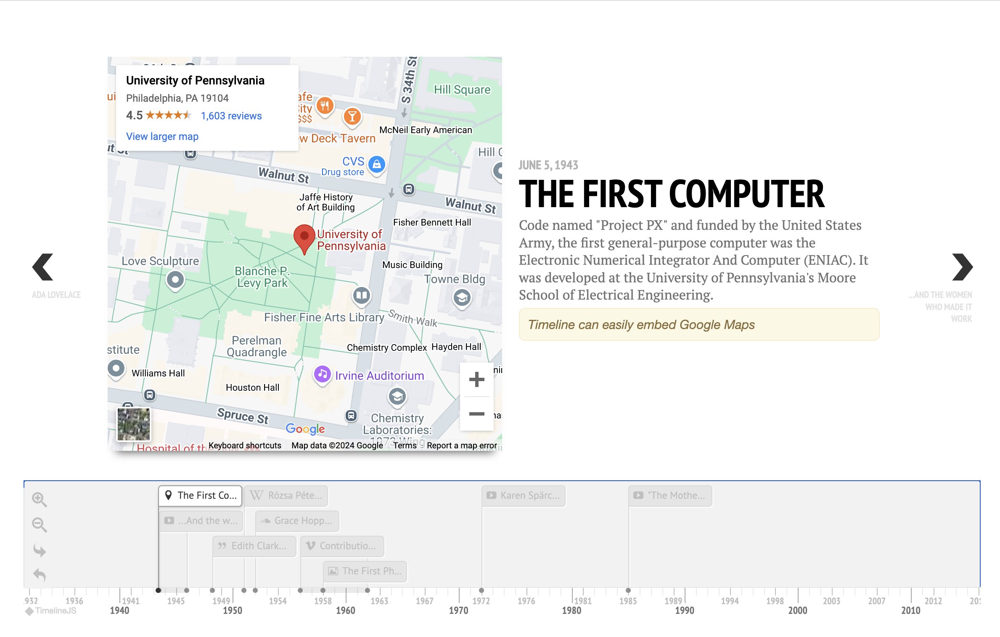
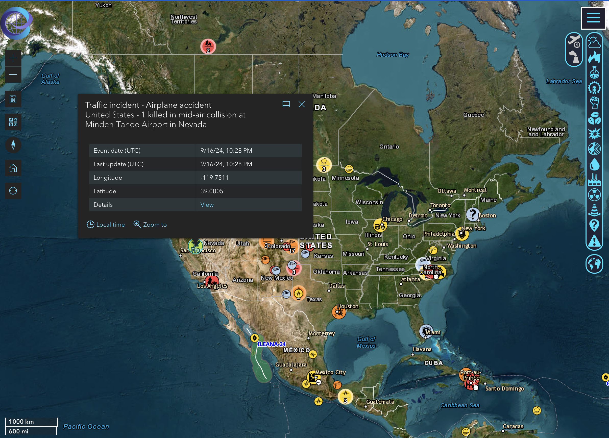
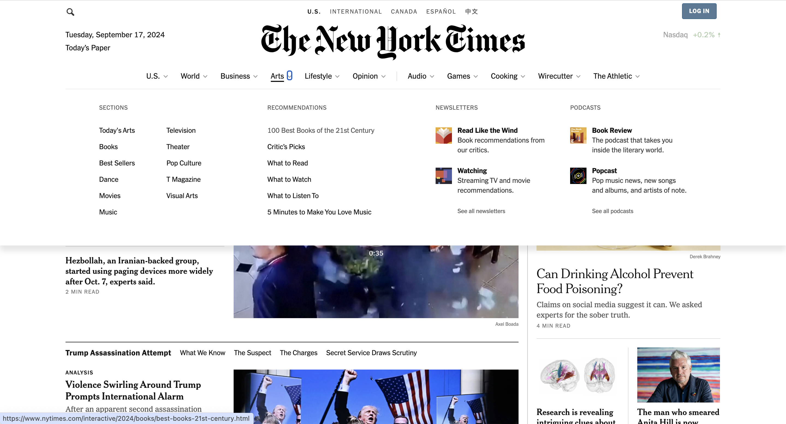
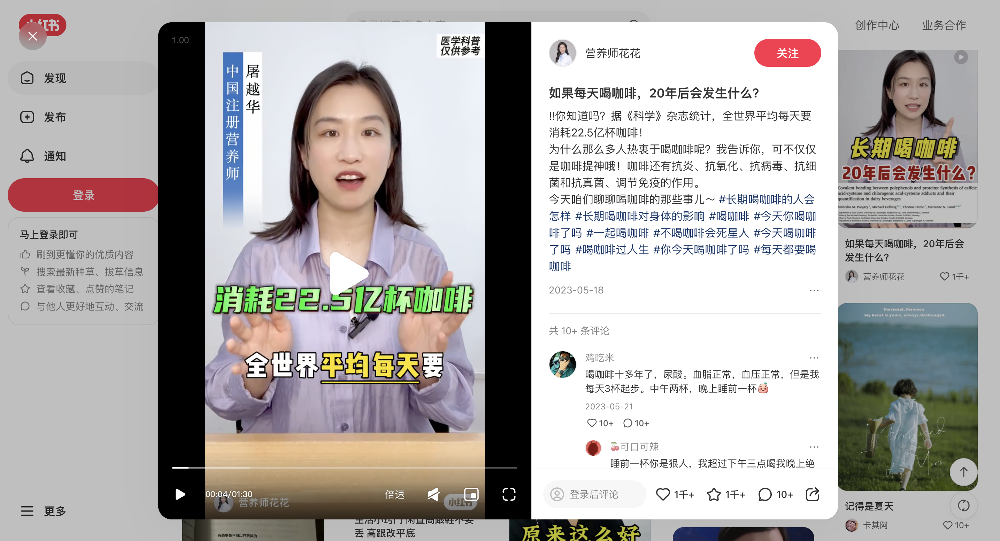
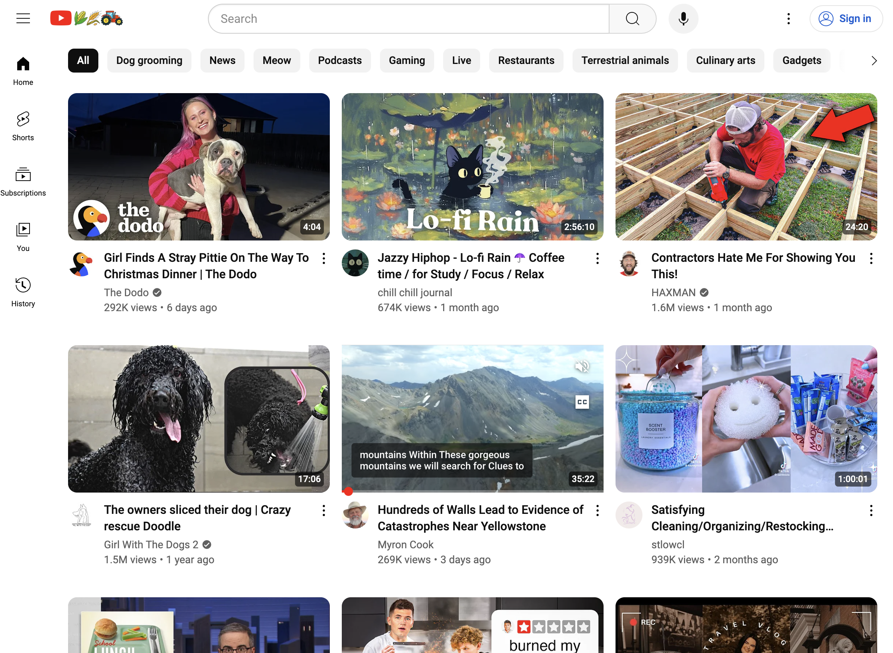
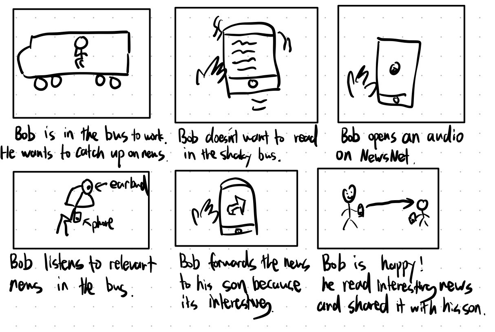
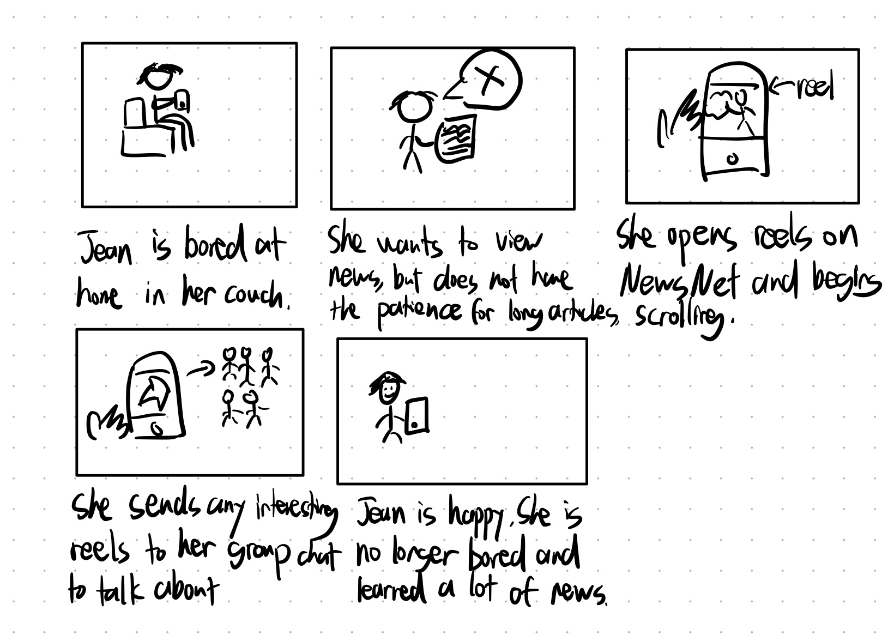

# Assignment 2: Divergent Design

## Broad Application Goals

**App Name:** NewsNet

**Intended Audience:** Mature professionals and individuals 30+ seeking a streamlined platform to access diverse, credible news sources without the distractions of traditional social media. 

**Value Proposition:** NewsNet offers a curated, practical platform that provides news, expert insights, and useful information tailored for mature users. Unlike traditional social media apps that focus on entertainment and can often be distracting, NewsNet integrates relevant news and advice with the easy-to-absorb formats of modern media, emphasizing practicality and productivity. 

## Scrapbook of Comparables
**Timeline**

*This image is from Timeline JS, showing an example timeline where events of "Women in Computing" have been placed. NewsNet can offer a similar timeline feature for news events, allowing for better visualization and follow ups after browsing a certain news event on NewsNet.*

**Map**

*This image is from Emergency and Disaster Service (EDIS), showing a disaster map. NewsNet can display news events on a map, so users who care about what is happening in certain locations can navigate there on a map. This could be helpful for people far from home, who may want to check in on how their hometown is doing.*

**Categorization**

*This image is from NYT, showing both its menu for selecting news topics and thumbnails for news articles. This is helpful for NewsNet which will offer a similar news categorization process, and news articles will be displayed in a similar fashion.*

**Reels**

*This image is from Xiao Hong Shu, showing a reel explaining the effects of daily coffee. NewsNet can create a reel feature specifically for news, allowing for short consumable bits of news content that is easily absorbed by users.*

**Videos**

*This image is from the Youtube homepage, displaying thumbnails of videos. NewsNet can display news videos in a dedicated tab in similar fashion.*

## Feature Ideas
1. **News Articles**: This is one of the main functions of NewsNet. Articles from credible sources and journals will be provided on a tab for browsing. This can look like scrolling through NYT on a phone. Any news content on NewsNet should be from a credible source, such as experts and news companies. This applies to videos, reels and audios as well.
2. **Video News**: Another essential format in which news can be consumed on NewsNet. Videos explaining or detailing news will be placed in a tab similar to Youtube, where by users can browse through and see relevant news videos. For example, users can easily watch a news video while having breakfast. 
3. **News Reel**: News can also be consumed in the form of short videos and reels, where similar to how people go on TikTok to scroll through short entertainment videos, a mature audience can come on NewsNet and scroll through short bits of News. 
4. **Audio News**: You can listen to news on NewsNet. Like listening to a Spotify song, while going about your day, you can pull up any news audio to listen to. 
5. **Direct Messages**: NewsNet should provide a direct message feature that acts in similar fashion to LinkedIn or Instagram's messaging. It will be helpful especially for sharing interesting or relevant news with others, while allowing for easy communication alongside that. Users may find it bothersome to exit out of the app to send a link through text messages, and having a chat function provides convenience as well as a dedicated space to talk about events.
6. **Follower**: Users should be able to follow accounts. This can look similar to Instagram following, where a mutual follow becomes a friend to allow for direct messaging. Following a source that is verified (see 11.) for posting on NewsNet can recommend or send alerts to the user when the source posts.
7. **Discussion Panels**: Discussion panels can be opened for users to speak their opinions about certain news or supplement additional information. This is open to the general public.
8. **News Categorization**: Any news will be sorted into a category on NewsNet. This will allow users to easily browse through topics they are interested while filtering out ones that they do not want to see. This will look very similar to the classification already implemented by news platforms such as NYT. 
9. **Recommendation Algorithm**: Along with categorization, there should also be a recommendation algorithm for each user that feeds them news they are likely to be more interesetd in. 
10. **Interest Expression**: Users should be able to mark as interested individual sources or topics. This will feed into the recommendation algorithm and allow for more relevant news to be displayed on NewsNet for its users. 
11. **Source Verification**: There should be a verification process for credible sources of news. Ideally, individuals should verify that they are a professional within the topic they are trying to post content on before being allowed to do so. Established news sources will be verified and given access as well.
12. **News Verification**: To prevent fake or malicious news, there should be a screening for posted news content (by algorithm, AI or manually). Even with verified sources, it is important to make sure that the news content is truthful and unbiased. These qualities will be essential for a professional news media. 
13. **Event Timeline**: As shown in the timeline comparable, having a timeline feature to display relevant events sequentially can be handy for following up on them. The timeline can be displayed at the bottom of an article / video, which allows for easy access to related events. 
14. **World Map**: As shown in the map comparable, having a map feature to display news events in relationship to the geographic location that they are happening can assist users who are interested in learning about what is going on in a certain location. This will be a world map, where events are displayed as ponters that can be colored based on the topic they belong too. 
16. **Group Chats**: NewsNet communication can have group chats, allowing for a group of people to easily share news with each other. This provides convenience so that if a user wants to share with multiple people, they do not have to share individually. Group chats can be created with friends, and will show up along with direct messages, like a WeChat group. 
17. **Sharing**: NewsNet can provide easy sharing of news media through the direct messages. Each article/video/reel can have a button for forwarding it, which then allows the user to choose someone 
18. **Profile**: Each user should be able customize their profile. This includes choosing a profile picture, and adding short bits of information such as gender, birthdays, etc. 

## VSD Analysis
1. **Penalties:** 
    - **Criterion**: Stakeholders, **Prompt**: Non-targeted Use, **Features**: News Verification, Source Verification, Discussion Panels
    - NewsNet may be used to spread biased information, propoganda or advertisements. Malicious content may get past the verification procedures, or discussion panels may be used for insults and heated arguments rather than discussion. 
    - **Design:** For these cases, NewsNet needs a penalty feature that gives out warnings, mutes and bans when users break certain policies. 
2. **International Censorship:** 
    - **Criterion**: Pervasiveness, **Prompt**: Crossing National Boundaries, **Features**: News Articles, Recommendation Algorithm
    - Certain countries may feel the need to censor certain information, such as China which might ban NewsNet. 
    - **Design:** In order to operate internationally, NewsNet may need certain filters for the recommendation system and news accessible by a user, specified by the country of the user. 
3. **Political Environment:** 
    - **Criterion**: Pervasiveness, **Prompt**: Political Realities, **Features**: News Articles, Discussion Panels
    - NewsNet may find itself in both Democratic and Socialist environments, which may change how freely people are able to express opinions in news and discussions. 
    - **Design:** Enabling anonymous publications and contributions to discussions may allow people to express their opinions more freely, but will require careful monitoring. Alternatively, filters similar to international censorship could work. 
4. **No Use:** 
    - **Criterion**: Time, **Prompt**: Choosing not to use, **Features**: Sharing
    - Not using NewsNet, if it becomes prevalent, may result in reduced access to timely information and weaker professional networks. 
    - **Design:** Aside from sharing through the messaging function in NewsNet, news should also be sendable via text messages and openable through a webpage, so that those not using the app can be kept in loop. 
5. **No Use:** 
    - **Criterion**: Stakeholders, **Prompt**: Variation in Human Ability, **Features**: News Audio, News Videos, News Reels
    - People with visual or hearing impairments need different ways to consume news from NewsNet
    - **Design:** For visual impairments, NewsNet may need voice commands to accompany audio, so that the user can still effectively navigate NewsNet. For hearing impairments, subtitles should be an option for videos and reels. 

## Storyboarding 

**News Audio**

**News Reels**

