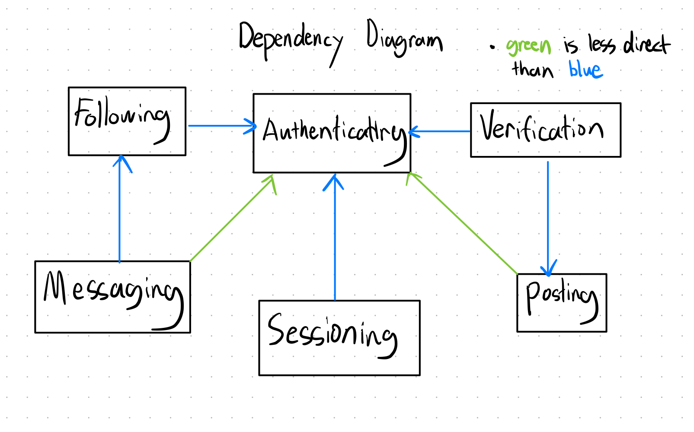

# Assignment 3: Convergent Design

## Pitch

Introducing **NewsWeave**—an intuitive platform designed specifically for mature users seeking more than just entertainment or superficial news. In today’s digital age, many platforms either overwhelm users with irrelevant content or prioritize social interactions over valuable information. NewsWeave changes that by offering a curated feed of news and expert advice to mature audiences who prioritize relevancy and practicality.

Unlike typical news platforms that lack the communal feel of social media, or social media sites that prove too distracting as news sources, NewsWeave strikes the perfect balance. It provides high-quality, concise, and practical information while fostering a sense of connection through a more thoughtful, distraction-free experience that can be shared with friends and family. Users can rely on personalized content that focuses on what matters—staying informed, making well-informed decisions, and discovering new opportunities for personal growth.

NewsWeave provides content from **verified** sources in multiple formats—articles, videos, podcasts, and summaries. Users can explore personalized recommendations after **authenticating** and can **follow** other users for a more connected experience. While browsing, verified users can also **post** their own content, sharing practical tips and expert advice. **Messaging** is available between mutual followers, fostering meaningful conversations without the distraction of traditional social media.

## Concepts

1. **Authenticating**:
    - Purpose: authenticate users so that app users correspond to people
    - Operational Principal: after a user u registers with email e and password p, they can authenticate by providing the unique pair (e, p).
    - State:
        - registered: set User
        - email: registered -> one String
        - password: registered -> one String
    - Action: 
    ```
    register(email: String, pass: String)
        registered += (email, pass)
    
    unregister(user: User)
        registered -= (user.email, user.password)
        active_users -= user

    authenticate(email: String, pass: String, out user: User)
        (email, pass) in registered

    verifyEmail(email: String, out valid: Boolean)
        # Verifies the email
    ``` 
2. **Sessioning**
    - Purpose: enable authenticated actions for an extended period of time
    - Operational Principal: After a session starts (and before it ends), the getUser action returns the user identified at the start.
    - State:
        - active: set Session 
        - user: active -> one User
    - Action: 
    ```
    start (user: User, out sess: Session) 
    getUser (sess: Session, out user: User) 
    end (sess: Session)
    ```
3. **Verification** 
    - Purpose: enable users to be verified to make posts. 
    - Operational Principal: User u can use the verify action to send a verification request, which will then be approved or rejected by adminstrators. 
    - State: 
        - verified: set User
        - requests: list Request
        - sender: Request -> one String
        - credentials: Request -> one Credential
    - Action: 
    ```
    verify(user: User, credentials: Credential)
        request = new Request(user, credentials)
        requests.append(request)
    
    add(user: User)
        verfied.add(user)
    
    remove(user: User)
        verified.remove(user)

    checkVerified(user: User, OUT verfied: Boolean)
        user in verified
    ```
4. **Following** 
    - Purpose: Enable users to connect to other users by following them, which allows for messaging and viewing certain posts
    - Operational Principal: Users can request to follow other users, and the ones requested can approve the request to establish a one-way or mutual connection. 
    - State: 
        - followers: map (User, set User)
        - following: map (User, set User)
        - followRequests: map (User, set User)
        - privacy: map (User, one of ("all", "requestOnly"))
    - Action: 
    ```
    request(sender: User, receiver: User)
        if privacy[receiver] == "all": 
            following[sender].add(receiver)
            followers[receiver].add(sender)
        else: 
            followRequests[receiver].add(sender)
    
    reject(user: User, requester: User)
        followRequests[user].remove(requester)

    accept(user: User, requester: User)
        followRequests[user].remove(requester)
        following[requester].add(user)
        followers[user].add(requester)

    checkMutual(first: User, second: User, OUT mutual: Boolean)
        second in following[first] and first in following[second]
    ```

5. **Messaging**
    - Purpose: enable communication between users
    - Operational Principal: After two or more users mutually follow each other, they can initiate a private chat. All messages are stored within the context of the conversation between the users.
    - State: 
        - messages: map (set User, list Message)
        - sender: Message → one User
        - content: Message → one String
        - timestamp: Message → one Timestamp
    - Action:
    ```
    initiateChat(users: set User)
        messages[users] = []
        
    sendMessage(chat: set User, message: Message)
        messages[users].append(Message)

    deleteMessage(user: User, message: Message, chat: set User)
        if message.sender == user: 
            messages[chat].remove(message)
    ``` 
6. **Posting**
    - Purpose: enable a user u to create and share a post p with their network or publicly.
    - Operational Principal: A user creates a post, which can contain text, images, or other media. Posts can be shared either publicly or with a specific set of users. Other users can interact with the post through discussions, or shares.
    - State: 
        - posts: set Post
        - author: Post -> one User
        - content: Post -> one Media
        - visibility: Post -> one of set(public, private, restricted)
        - timestamp: Post -> one Timestamp
        - discussions: map (Post, list Comment)
    - Action: 
    ```
    createPost(user: User, content: String, visibility: String)
        post = (user, content, visibility, timestamp)
        posts += post

    deletePost(user: User, post: Post)
    if post.author == user:
        posts -= post
        discussions.remove(post)
    
    comment(user: User, post: Post, content: String)
    # if user is allowed in post visibility setting:
        comment = (user, content, timestamp)
        discussions[post] += comment
    ```

## Synchronizations
```
app NewsNet 
    include Authenticating[User]
    include Sessioning[Session]
    include Verification[Credential]
    include Following
    include Messaging[Message] 
    include Posting[Post, Media, Timestamp]

sync login (email: String, password: String, OUT user: User, OUT s: Session)
    Authenticating.authenticate(email, password, OUT user)
    Sessioning.start(user, OUT s)

sync logout (s: Session)
    Sessioning.end(s)

sync requestVerification (s: Session, credentials: Credential, OUT request: Request)
    Sessioning.getUser(s, OUT user)
    Verification.verify(user, credentials, OUT request)

sync approveVerification (admin: User, request: Request)
    Verification.add(request.sender)

sync rejectVerification (admin: User, request: Request)
    Verification.remove(request.sender)

sync follow (s: Session, target: User)
    Sessioning.getUser(s, OUT user)
    Following.request(user, target)

sync acceptFollowRequest (s: Session, requester: User)
    Sessioning.getUser(s, OUT user)
    Following.accept(user, requester)

sync rejectFollowRequest (s: Session, requester: User)
    Sessioning.getUser(s, OUT user)
    Following.reject(user, requester)

sync createPost (s: Session, content: String, visibility: String, OUT post: Post)
    Sessioning.getUser(s, OUT user)
    Verification.checkVerified(user) 
    Posting.createPost(user, content, visibility, OUT post)

sync deletePost (s: Session, post: Post)
    Sessioning.getUser(s, OUT user)
    Posting.deletePost(user, post)

sync commentOnPost (s: Session, post: Post, content: String)
    Sessioning.getUser(s, OUT user)
    Posting.comment(user, post, content)

sync initiateChat (s: Session, recipients: set[User], OUT chat: set[User])
    Sessioning.getUser(s, OUT sender)
    Messaging.initiateChat(recipients + sender)

sync sendMessage (s: Session, chat: set[User], content: String, OUT message: Message)
    Sessioning.getUser(s, OUT sender)
    Following.checkMutual(chat)
    Messaging.sendMessage(chat, (sender, content, timestamp), OUT message)

sync deleteMessage (s: Session, message: Message, chat: set[User])
    Sessioning.getUser(s, OUT user)
    Messaging.deleteMessage(user, message, chat)
```

## Dependency Diagram


## WireFrames
[Link to WireFrames](https://www.figma.com/proto/s6JcSUkV3YkiWBgwTYlDYi/A3-Wireframe?node-id=2075-440&node-type=canvas&t=fonHAxjDnGzANQlq-1&scaling=min-zoom&content-scaling=fixed&page-id=0%3A1&starting-point-node-id=2075%3A440)

## Design Tradeoffs
### Decision: Posting dependency on Verification

**Options:**
- Implement a verification process for users before they can post content. (Chosen)
- Allow all authenticated users to post without verification.

**Rationale:**
While it can be a tedious process, implementing a verification process ensures that only trustworthy users can share content on the platform. This helps maintain the quality and relevance of posts, particularly important for mature users who may be more susceptible to misinformation. By limiting posting privileges to verified users, we can create a more reliable content environment, fostering trust among the community.

### Decision: Public vs. Private Posts

**Options:**
- Allow users to choose between public and private posts. (Chosen)
- Make all posts public by default.

**Rationale:**
Enabling users to choose the visibility of their posts empowers them to control their personal information and who can see their content. This can be more comforting for smaller sources who may want only want to broadcast to their personal network. This also encourages users to build connections with sources in order to access their content, stimulating a sense of community on NewsNet. 

### Decision: Public vs. Private Posts

**Options:**
- Allow users to choose between public and private posts. (Chosen)
- Make all posts public by default.

**Rationale:**
Enabling users to choose the visibility of their posts empowers them to control their personal information and who can see their content. This can be more comforting for smaller sources who may want only want to broadcast to their personal network. This also encourages users to build connections with sources in order to access their content, stimulating a sense of community on NewsNet. 

### Decision: General Discussion Forum vs. Individual Discussion Sessions

**Options:L**
- Create a general discussion forum for all users to share thoughts and engage in open conversations.
- implement individual discussion sessions for each media post or message. (Chosen)

**Rationale:**
Choosing individual discussion sessions for each media post fosters more relevant and focused conversations, allowing users to engage directly with specific content. Users can discuss the context of a particular post without the distractions of unrelated topics that would arise in a general forum. It also helps mature users feel more comfortable participating, as discussions are confined to specific subjects, reducing the intimidation of larger, broader forums. 


