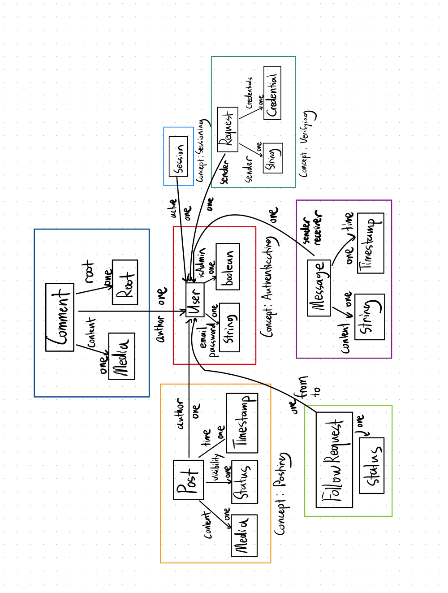

# Assignment 4 (Alpha) - Backend Design & Implementation

## For Alpha Submission: 

Messaging and Verifying have been fully implemented. RESTful routes for Discussing is also in routes.ts. 

[Deployed](https://backend-two-hazel-80.vercel.app/)

[Github](https://github.com/tonyx1107/backend.git)

## Abstract Data Models

### Concept 1: Authenticating
- State:
    - registered: set User
    - email: registered -> one String
    - password: registered -> one String
    - isAdmin: registered -> one Boolean

### Concept 2: Sessioning[User]
- State:
    - active: set Session 
    - user: active -> one User

### Concept 3: Verifying[User]
- State: 
    - verified: set User
    - requests: set Request
    - sender: Request -> one String
    - credentials: Request -> one Credential

### Concept 4: Following[User]
- State: 
    - followers: User -> set User
    - following: User -> set User
    - requests: set Request
    - from: requests -> one User
    - to: requests -> one User
    - privacy: User -> one Status

### Concept 5: Messaging[User]
- State: 
    - messages: User -> set Message
    - sender: Message -> one User
    - receiver: Message -> one User
    - content: Message -> one String
    - timestamp: Message -> one Timestamp

### Concept 6: Posting[User]
- State:
    - posts: set Post
    - author: Post -> one User
    - content: Post -> one Media
    - visibility: Post -> one Status
    - time: Post -> one Timestamp

### Concept 7: Discussing[User, Root]
- State:
    - discussions: set Comment
    - author: Comment -> one User
    - content: Comment -> one Media
    - root: Comment -> one Root

## Data Model Diagram
