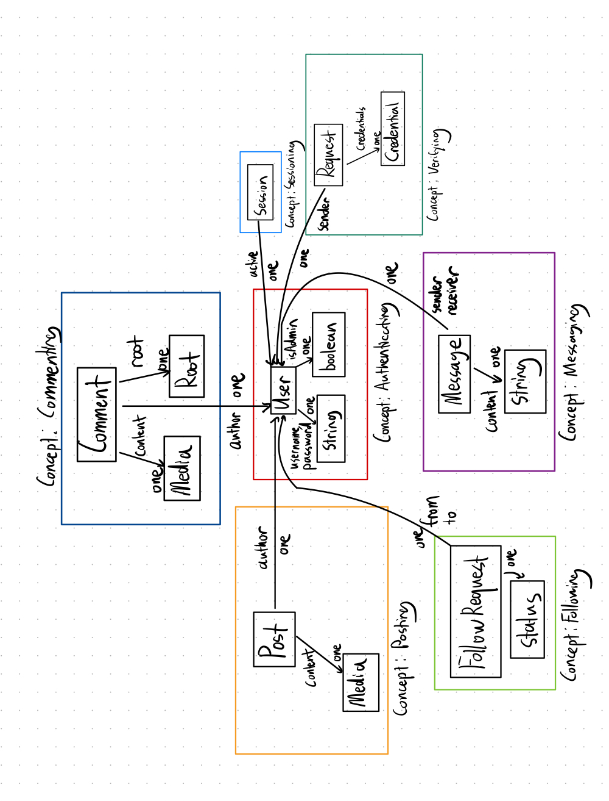

# Assignment 4 (Beta) - Backend Design & Implementation

## Relevant Links
- Deployed Site: [Deployed](https://backend-two-hazel-80.vercel.app/)
- Github Repo: [Github](https://github.com/tonyx1107/backend.git)

## Abstract Data Models

### Concept 1: Authenticating
- State:
    - registered: set User
    - username: registered -> one String
    - password: registered -> one String
    - isAdmin: registered -> one Boolean

### Concept 2: Sessioning[User]
- State:
    - active: set Session 
    - user: active -> one User

### Concept 3: Verifying[User]
- State: 
    - verified: set User
    - requests: set Request
    - sender: Request -> one String
    - credentials: Request -> one Credential

### Concept 4: Following[User]
- State: 
    - followers: User -> set User
    - following: User -> set User
    - requests: set Request
    - from: requests -> one User
    - to: requests -> one User

### Concept 5: Messaging[User]
- State: 
    - messages: User -> set Message
    - sender: Message -> one User
    - receiver: Message -> one User
    - content: Message -> one String

### Concept 6: Posting[User]
- State:
    - posts: set Post
    - author: Post -> one User
    - content: Post -> one Media

### Concept 7: Discussing[User, Root]
- State:
    - discussions: set Comment
    - author: Comment -> one User
    - content: Comment -> one Media
    - root: Comment -> one Root

## Data Model Diagram

## Reflection

While implementing the backend service, I encountered several key design decisions that led me to refine the original conceptual structure. One such decision was allowing messaging between all users, rather than restricting it to friends only. I decided to use this approach to encourage open communication, especially between users and content creators, who may not necessarily be "friends" but still benefit from interaction, particularly around topics like news.

I also removed extra states from concepts that seemed unnecessary. For example, the "friends" state, which is essentially the intersection of followers and following, was redundant. Similarly, in the verification process, I initially considered having a status state for requests (e.g., pending, approved, rejected). However, it became clear that once a request is approved or rejected, it should simply be deleted, eliminating the need for an extra status field.

Another important consideration was whether verification should be an independent concept or part of authentication. I chose to keep it separate, despite its connection to requests, following, and authentication. Verification involves a distinct process requiring administrator approval, and having it as an independent concept improved modularity, making the system more maintainable and scalable.

Overall, Implementing the backend helped me flush out my ideas for the concepts and clarify areas that were initially ambiguous. The implementation phase forced me to rethink the relationships between concepts and refine the design, resulting in what I believe to be a more reasonable and maintainable system.
