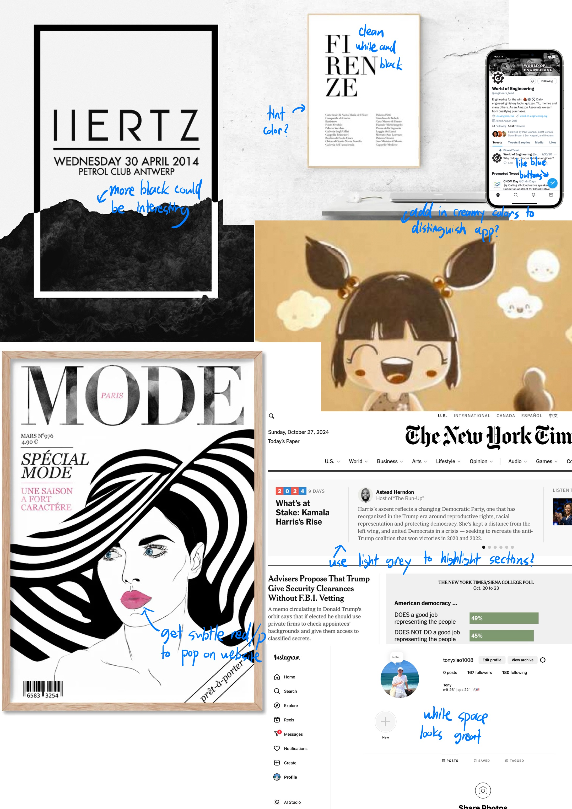
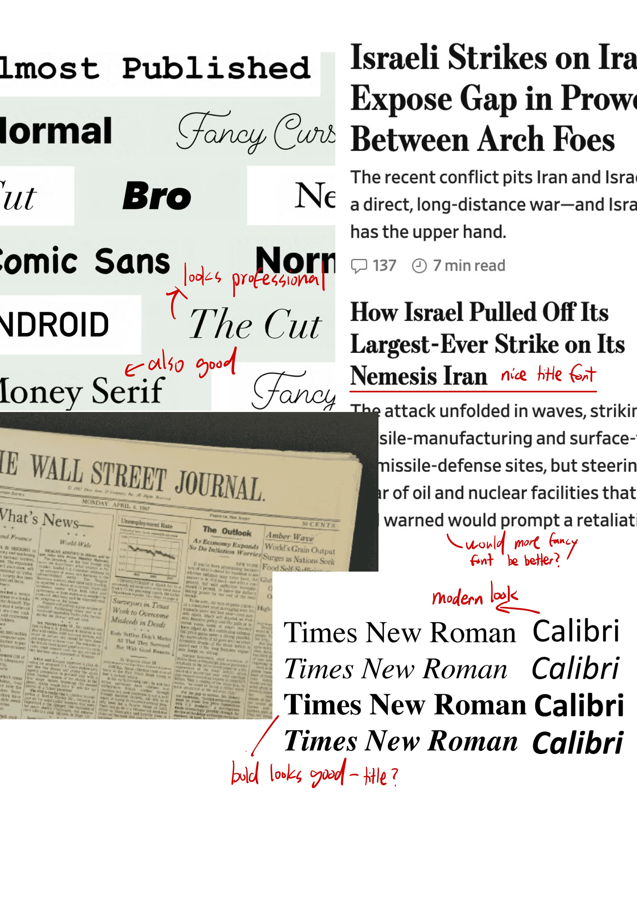

# Assignment 5 (Beta) - Frontend Design & Implementation

## Relevant Links
- Deployed Site: [Deployed](https://a5bfrontend-p3n228xh3-tony-xiaos-projects-2fcc7839.vercel.app/)
- Github Repo: [Github](https://github.com/tonyx1107/test-frontend)
- A3 Wireframes: [Figma](https://www.figma.com/proto/s6JcSUkV3YkiWBgwTYlDYi/A3-Wireframe?node-id=2075-440&node-type=canvas&t=2Gg83fYj6LNwxfSE-1&scaling=min-zoom&content-scaling=fixed&page-id=0%3A1&starting-point-node-id=2075%3A440)

## Heuristic Evaluation

### Usability Criteria

**Pleasantness:**
- For pleassantness, my wireframe provides a calm interface. The black-and-white color scheme reinforces a distraction-free environment, catering specifically to NewsNet’s target audience of older users who may prefer simplicity. The overall layout is also minimalistic, allowing for easy navigation to different media in a tabs bar at the bottom of the screen. Each media tab has its consistent formatting, meaning that browsing is predictable, avoiding the need for visible grid lines while still providing a clean, organized feel.  
- For improvement: First, the varying sizes of news articles—where some include image thumbnails and others do not—might lead to inconsistent visual spacing. Some size constraints will definitely need to be implemented for thumbnails. 
- Second, the search tab currently displays different types of media within the same results, which may disrupt the intended sense of structure. (This also applies to Geralt's law in the physical heuristics). Rather than having an overall search, it may be helpful to add filtering options in the search bar for a specific media, or to have the search change based on what media tab the user is currently on. 

**Discoverability:**
- Overall, the wireframe demonstrates strong discoverability. The tab icons are intuitive and clearly correspond to their functions, making it easy for users to navigate the platform. Users can explore all the news media types in just four clicks (one per tab). The interface design for each tab also reflects familiar layouts from popular apps, such as a YouTube for news videos, making navigation easily understandable.
- Similarly, the buttons at the top (post, search, message, and account) use universally recognizable icons, ensuring that users can easily interact with them. A single tap again reveals straightforward, familiar interfaces. The app's overall discoverability is strong, owing to its simplicity and reliance on familiar design patterns. 
- One potential improvement would be to address the requirement for user verification before posting. It may not be immediately obvious to new users that posting on the platform requires verification. To enhance the experience, the app could guide users to the verification request page when they attempt to post, making sure they understand this requirement.

### Physical Heuristics
**Fitt's Law:** 
- As mentioned in the discoverability section, most essential features are easily accessible with just a couple of taps on a mobile screen. The media tabs, which users are expected to interact with frequently, are positioned on the bottom bar. This placement makes them easily reachable with one hand, allowing the thumb to comfortably navigate each tab while holding the phone.
- Similarly, selecting a news media item to view in detail is designed to be effortless, requiring only one tap with the hand already in position. This is consistent across all media types, maintaining ease of interaction.
- While the top bar is less convenient to reach, it houses features that are expected to be used less often. For example, posting content, accessing account information, or messaging others might not be as frequent for users on a news-focused platform like NewsNet. Although reaching the top bar may require a bit more effort than browsing the bottom tabs, each feature is still accessible with a single tap.
- One concern is whether the search button should remain in the top bar. Since searching for specific news might be a key activity for users, relocating the search function to the bottom bar could enhance usability. Additionally, the top bar has less space, which could increase the likelihood of users accidentally tapping the wrong button when attempting to search, relating to the Safety heuristic. 

**Situational context:**
- The wireframe currently does not tell the user where they are, and requires them to use the context of their tab. While each tab is unique and identifiable, the user's situational context can be further improved. For example, by highlighting which news tab in the bottom the user is on, they will have a clearer idea, and also avoid clicking the tab they are already on when navigating. 
- The situational context in the top bar tabs is not directly labeled either, but these have sufficient context clues. For instance, the profile page has a large profile icon along with profile logistics. similarly, the search page has a search bar, messages shows chat histories, and posting is titled "new post". 
- Overall, the situational context is already reasonably understandable, and can be improved by highlights on tabs the user is currently on. 

### Linguistic Level

**Consistency:**
- For the three of the browsing pages and searching, the interface retains a top down scrolling approach, and uses consistent structuring to make it feel similar regardless of tab. The other pages are slightly less consistent, but show more consistency to interfaces used in different popular platforms. 
- For instance, The top bar features icons that closely resemble those on platforms like Instagram, and the Account and messaging pages also use Instagram’s layout. The video and reels pages are similar to YouTube’s videos and shorts, while the audio page presents thumbnails similar to those used on Audible.
-  The bottom bar icons are less obvious, as articles is not a traditionally used tab, and reels tend to have unique icons for different platforms. 
- Overall, the wireframes are fairly consistent within NewsNet, and also share large similarities with outside popular platforms. 

**Speak a user's language:**
- The wireframes of NewsNet do not provide many informative messages to help users. For instance, in any of the news media tabs, users will not know what tab they are on from any text, but will realize by seeing the thumbnails placed for the news medias. 
- Informative labeling can be seen in the account page for following, the search bar within the search page, and the text "new post" in the posting page. These are used to identify functionalities that may not be as obvious without the text. 
- More text could be added to help a user understand where they are, tying into situational context, but as mentioned doesn't seem extremely necessary for the simple processes involved when using NewsNet. 

## Visual Design Study

My app is a news/media platform designed for more mature users. As such, from the get go, I wanted to achieve a minimalistic interface that was clean and organized. Colorwise, black and white schemes, especially dominantly white, seemed to fit my platform well, and were my primary target. In the process of looking at colors, I thought that perhaps small amounts of more vibrant colors could give the website more life, and they especially made sense with items such as editing and deleting buttons that should have some kind of emphasis to differentiate them. For these, Twitter's interface, which added light blue, seemed to fit in well, and I got a softer red for my warning buttons. I looked to examples such as news sites like NYT and Wallstreet Journal, aesthetically pleasing white posters, and used Instagram as my example of how to let the white space feel organized. 

For fonts, I had two approaches in mind. Either going for a slightly fancy font with sharp edges, such as Times New Roman, or going with a simplistic approach like Calibri and Arial. I tested both on my webpage, and thought that Times New Roman like fonts inspired a more professional feel that went well with a mature news media platform. Titles popped a lot better with a bolded slightly curled font. 

