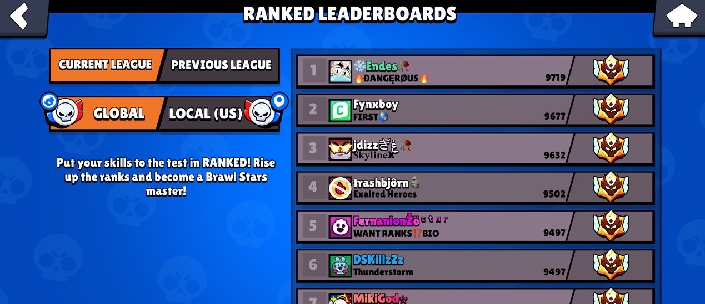

# Project Phase 2 - Divergent Design

## Broad Application Goals

### App Name: ReCycle

### Intended Audience

ReCycle targets people who want to recycle but do not know how to recycle items correctly and  people who do not recycle because they consider it too complicated or lack motivation.

### Value

Because of a lack of clear education on waste management, and varying recycling policies between local communities, people who might want to recycle either recycle incorrectly or do not recycle in the first place. Beyond education, existing recycling applications only fit specific use cases, such as targeting specific communities or requiring a barcode to scan. ReCycle aims to close the gap by bringing general utility, and helping people recycle more items in various locations.

## Scrapbook of Comparables

### Scrapp Barcode Scanner

Scrapp's barcode scanning feature allows users to identify recyclability by scanning a product’s barcode, simplifying the recycling process for items with packaging labels. While Scrapp’s feature is limited to items with barcodes, ReCycle’s camera scanning feature could improve on this by identifying any item using ML & AI, including those without barcodes—like apple cores, plastic utensils, or crumpled paper. This could improve the versatility of ReCycle to handle a broader range of waste items, enhancing user convenience by guiding correct disposal for nearly any material.

### Scrapp Personal Progress Tracker

Scrapp’s personal recycle history/progress tracking feature allows users to see their recycling habits over time, motivating them to recycle more consistently by providing insights into their efforts. This feature could inspire a similar feature in ReCycle, where users might track their own recycling achievements, get reminders, or even earn rewards for consistent recycling behavior. This kind of feedback loop could help engage users by making them feel accomplished, and fostering long-term habits of correct waste disposal.

### Yelp Restaurant Map

Yelp’s map of the nearest restaurants lets users quickly locate nearby dining options, enhancing convenience by visually displaying choices based on proximity. For ReCycle, a similar map feature could show the locations of nearby recycling bins, drop-off points, or waste sorting facilities, making it easier for users to find proper disposal sites in their area. This could be particularly helpful for items that require specialized recycling, such as electronics or hazardous materials, as well as places where recycling bins may not be as common or easily found.

### Shazam Song Identification

Shazam uses audio recognition to identify songs by analyzing and matching sound patterns. Similarly, ReCycle could use image recognition via the camera to identify waste items, helping users determine the correct recycling bin. Both apps simplify decision-making by providing a quick, intuitive solution to identify something specific—in ReCycle's case, which bin to use for disposal. This parallel could inspire ReCycle's interface design, focusing on a user-friendly way to capture and classify items with minimal steps.

### Brawl Stars Leaderboards

Brawl Stars’ global and regional leaderboards rank players by performance, adding a competitive and social element that motivates continued engagement. For ReCycle, a similar leaderboard could track users’ recycling contributions on local, regional, or global scales, encouraging friendly competition to recycle more and recycle correctly. This could help ReCycle users feel connected to a larger community goal, potentially sparking positive behavior change by showcasing users’ impact on waste reduction.

### MyNetDiary Calorie Tracker

 
MyNetDiary's daily calorie tracker encourages users to meet health goals by monitoring their food intake against a daily target, creating a clear, achievable objective. ReCycle could adopt a similar feature with daily recycling goals, where users track the items they recycle each day, working towards a set target. This daily goal system could keep users engaged and mindful about recycling, helping them build consistent habits while visually rewarding their progress and impact on reducing waste.

### Google Lens Image Recognition

Google Lens allows users to identify objects, plants, animals, and more by analyzing an image 
through AI and machine learning. This object-recognition approach could be a useful model for ReCycle’s camera feature, allowing users to photograph waste items for classification. Like Google Lens, ReCycle’s interface could provide an immediate result with suggestions for proper disposal, enhancing usability and accuracy.

### Duolingo Daily Streak

Duolingo’s daily streaks motivate users to practice consistently by rewarding consecutive days of engagement and building long-term habits through positive reinforcement. ReCycle could incorporate a similar streak feature, encouraging users to recycle correctly each day to maintain their streak. This could make recycling feel rewarding and fun, reinforcing consistency as users work to reach personal or community recycling milestones, ultimately fostering a habit of responsible waste management.

### Apple Health Weekly Summary

Apple Health provides a weekly summary of users' physical activity, showing trends, achievements, and goals met. A similar weekly recycling summary in ReCycle could give users an overview of their recycling patterns, like how much waste they’ve recycled, types of materials, and cumulative environmental impact. This feature could increase user engagement by making progress tangible and highlighting environmental contributions over time.

### League of Legends Achievement Badges

In League of Legends, players earn badges, titles, and player borders that can be used to customize their profiles, obtained via achievements like reaching certain ranks or mastering a character. Similarly, ReCycle could use achievement badges, titles, or profile borders to reward users for recycling milestones—such as consistently recycling daily, achieving a high ReCycle streak, or reaching a total item goal. These rewards could add a sense of progression and personal accomplishment, motivating users to keep recycling.

## Brainstorm of Feature Ideas
### 1. Recycle Classification
Users can take a photo of an item they want to recycle, and the app analyzes the image to determine if the item is recyclable. It then provides detailed instructions for proper disposal, including any relevant recycling rules based on the user’s location. This feature is designed to simplify recycling by making it as easy as snapping a photo.

### 2. Text Classification
For users who prefer not to use the camera, this feature allows them to type a brief description of the item. The app processes the text to provide recycling guidance and instructions. This backup option ensures all users can access disposal information, regardless of how they choose to engage.

### 3. ReCycle Score
Every time a user engages in recycling, their efforts are recorded and contribute to an overall environmental score. This score reflects the user’s positive impact and motivates them to recycle more by rewarding points for each action. It gamifies the recycling experience and provides users with a measurable sense of accomplishment.

### 4. ReCycle Community
Users can form or join groups to support and track each other's recycling efforts. Within these communities, users can share tips, encourage each other, and celebrate recycling milestones together. This feature fosters a collective spirit and reinforces sustainable habits within social circles.

### 5. Friends
Users can add friends to view each other's recycling progress and share their recycling journey. By seeing friends’ activity, users are encouraged to recycle more often and build sustainable habits together. This feature supports friendly, positive reinforcement among peers.

### 6. Activity Feed
Displays a social feed of recycled items, where users can post about their recycling activities for others to see. Users can choose to keep posts private or share special moments publicly. This feature adds a social dimension to recycling, making it visible and rewarding to both users and their friends.

### 7. Recycle Leaderboard
The leaderboard ranks users within communities by recycling score, encouraging healthy competition. By comparing their scores, users are inspired to recycle more frequently and improve their environmental impact. This feature helps build motivation within a community through friendly competition.

### 8. Bumping
A “nudge” feature allows community members to send gentle reminders to encourage each other to stay active in recycling. When someone has been inactive, friends or community members can give them a quick motivational push. This feature strengthens accountability and camaraderie among users.

### 9. Recycle Goal
Users can set personal recycling targets, like recycling a specific number of items each week. By setting and tracking these goals, users can stay motivated and see their progress toward forming a regular recycling habit. This feature turns recycling into a more consistent and goal-driven activity.

### 10. Waste Diary
Logs each user’s recycling activities, providing insights into monthly totals, item types, and environmental impact over time. It generates statistics like total carbon offset to highlight the broader impact of the user’s actions. This diary helps users reflect on their habits and the positive difference they make.

### 11. Recycling Tips
A feed that offers advice and best practices for recycling, including tips tailored to specific items based on what users upload. The tips are designed to help users recycle more effectively and learn about the environmental benefits of their choices. This feature acts as a helpful guide to improve users’ recycling knowledge.

### 12. Product Impact Checker
When users scan an item, the app provides information on its environmental impact, such as the carbon footprint or resource use associated with it. It also suggests eco-friendly alternatives, giving users options to make more sustainable choices. This feature raises awareness about product impact and encourages conscious consumption.

### 13. Disposal Map
An interactive map that shows nearby locations for specific recycling needs, like plastic or electronics recycling points. Users can get directions to the nearest appropriate bin or facility. This feature makes it easier for users to find the right place to dispose of various recyclables.

### 14. Activity Heatmap
This map displays hotspots where ReCycle users frequently dispose of or classify recyclables, revealing areas with active recycling communities. Users can view the map to find popular recycling zones or inspire others by increasing activity in less active areas. It showcases community engagement visually.

### 15. Cosmetic Shop
Users can redeem their ReCycle Score for customizable items like profile badges, themes, or stickers. These items personalize profiles and showcase achievements. This feature lets users visually express their commitment to recycling within the app community.

### 16. Daily Quiz
A short daily quiz that tests users’ recycling knowledge, offering points for correct answers. The quizzes reinforce recycling concepts and encourage users to keep learning in a fun way. It’s a quick, engaging way to stay informed about sustainable practices.

### 17. Quests
Users receive tasks, or "quests," like recycling a certain number of specific items within a time limit, to earn points. These periodic quests make recycling fun and give users a chance to earn rewards for their efforts. They add variety and excitement to everyday recycling activities.

### 18. Eco Milestones
Users earn badges for recycling achievements like “Recycled 100 items” or “Plastic-free month.” These milestones celebrate progress and provide visual rewards that users can display on their profiles. This feature highlights significant achievements and motivates continued engagement.

### 19. Recycling Milestone Sharing
Allows users to share their recycling milestones on social media, like reaching a certain ReCycle Score or completing eco-friendly challenges. By sharing, users can inspire others to adopt sustainable practices or join the app. This feature turns individual achievements into a larger call to action.

### 20. Virtual Garden
As users recycle, they grow a virtual garden with new plants and landscapes unlocked by hitting recycling milestones. This garden serves as a visual representation of their environmental contributions. It’s a relaxing, creative reward system that links recycling efforts to tangible progress.

### 21. ReCycle Streaks
Encourages users to recycle daily, with each consecutive day adding to a streak and boosting the ReCycle Score. Longer streaks unlock additional rewards, motivating users to make recycling part of their daily routine. This feature helps build a strong recycling habit.

### 22. User Feedback
Users can rate the accuracy of recycling classifications with thumbs-up or thumbs-down responses. This feedback helps improve the app’s item recognition over time, ensuring accurate guidance. It allows users to contribute directly to the app’s improvement.

### 23. Community Challenges
Communities can participate in challenges where they compete against other groups to recycle the most within a set period. These timed challenges encourage teamwork and collective action. It’s a fun way for users to rally together for a common cause.

### 24. Material Database
A searchable reference for information on recycling and disposing of materials, from plastics to electronics. Users can look up specific items to find the best recycling practices. This database provides a reliable source for proper disposal information.

### 25. Regional Recycling Info
Provides region-specific recycling guidelines based on the user’s location. Users receive local policies and instructions for specific items to comply with area regulations. This feature helps users make responsible choices based on where they live.

### 26. Recycling Reminders
Users can set up reminders for specific days or times to check their waste for recyclables. These reminders make it easy to remember routine recycling checks and prevent recyclables from ending up in the trash. It’s a helpful tool for creating a consistent recycling habit.

### 27. Event Notifications
Alerts users to local recycling events, such as neighborhood cleanups or electronic waste drives. Users can attend these events to earn extra points and engage with their community. This feature helps connect users to real-world recycling opportunities.

### 28. Recycling Spots
Users can submit and review recycling locations to help others find accurate disposal points nearby. This crowdsourced data keeps disposal locations up-to-date and makes recycling easier for everyone. It’s a collaborative way to improve recycling accessibility.

### 29. Educational Videos
A library of short videos on topics like recycling processes, material recovery, and sustainable practices. These videos help users learn more about recycling and make informed choices. It’s an easy way for users to expand their environmental knowledge.

### 30. Recycling Battle
An interactive trivia game where users test their recycling knowledge against others by sorting virtual waste. Correct answers earn points, while users get a chance to practice recognizing recyclable items. This feature adds a fun, competitive twist to recycling education.

## Concept Outline

### Concept 1: Identifying
#### Purpose
Determining what an item is from a photograph of that item to decide if that item is recyclable or not
#### Operational Principle
A user provides a photograph of an item, such as an apple core, and receives an identification (“apple core”) of what that item is.  

### Concept 2: Classifying [Item]
#### Purpose
Determining if an item is recyclable or not
#### Operational Principle
A user provides an item. If the item does not need to be trashed, such as an apple core or a piece of paper, the user will receive a classification of where that item can be disposed (food waste, paper recycling). If the item is not recyclable, such as a used drink container, they will receive a classification that the item needs to be trashed.

### Concept 3: Locating [Item, Location]
#### Purpose
Determining where the nearest disposal bin is to a user
#### Operational Principle
After providing a waste disposal category and a current location, a user can retrieve the disposal bin of that category nearest to their current location

### Concept 4: Scoring [User]
#### Purpose
Evaluating how good a user is at recycling
#### Operational Principle
After creating a score for a user, that score can increase or decrease. When a user looks up their score, they will see the final value after all the modifications.

### Concept 5: Leaderboarding [User, Score]
#### Purpose
Ranking users based on how well they recycle
#### Operational Principle
Given a collection of users, a user can see a ranking of those users based on their current scores, with higher scores given higher rankings. A user can add or remove users from the collection to see different rankings.

### Concept 6: Reminding [User]
#### Purpose
Reminding users to recycle if they have not recycled recently
#### Operational Principle
After indicating a user, if a certain amount of time has passed since that user has last used the app, that user will require a reminder. If the user has used the app within the time frame, that user will not require a reminder.

### Concept 7: Friending [User]
\**Adapted from TA Review Session*\*
#### Purpose
Creating a relationship between two users
#### Operational Principle
After indicating another user, the current user can add the other user to their list of friends. After that other user is added, the current user can remove the other user from their list of friends.

### Concept 8: Grouping [User]
\**Adapted from TA Review Session*\*
#### Purpose
Creating relationships between friends in order to establish communities 
#### Operational Principle
After a user creates a group, until a user deletes the group, that user can add users to that group and remove currently added users from that group.

## Storyboard and Sketches

### Story 1: Waste Classification from Image

#### Motivation
Richard has some trash from eating at Dunkin Donuts and wants to recycle it. He doesn’t remember if his iced coffee cup is recyclable. He knows that nonrecyclable contamination can ruin the chances of all the items in the recycling bin from being recycled. Thus he doesn’t want to recycle it if it can’t be recycled.

#### Notes on Brittleness/Unclear Areas
- What happens if there are multiple items in one photo?
- What if the app can’t decide if something is recyclable from the photo

### Story 2: Finding a Recycle bin
#### Motivation
Rhea printed out a lot of paper while studying for her 6.160 exam. She wants to recycle it but can’t find a bin.

#### Notes on Brittleness/Unclear Areas
- When should the app ask for a user location? All the time? Just when looking at a map?
- What if the user doesn’t want to share their location? 

### Story 3: Competing on Leaderboard
#### Motivation
Tony’s friends want him to recycle more, but Tony hates the environment and doesn’t feel motivated to recycle.

#### Notes on Brittleness/Unclear Areas
- How to promote recycling with leaderboards without promoting increased waste?
- Have a global leader or just show friends?