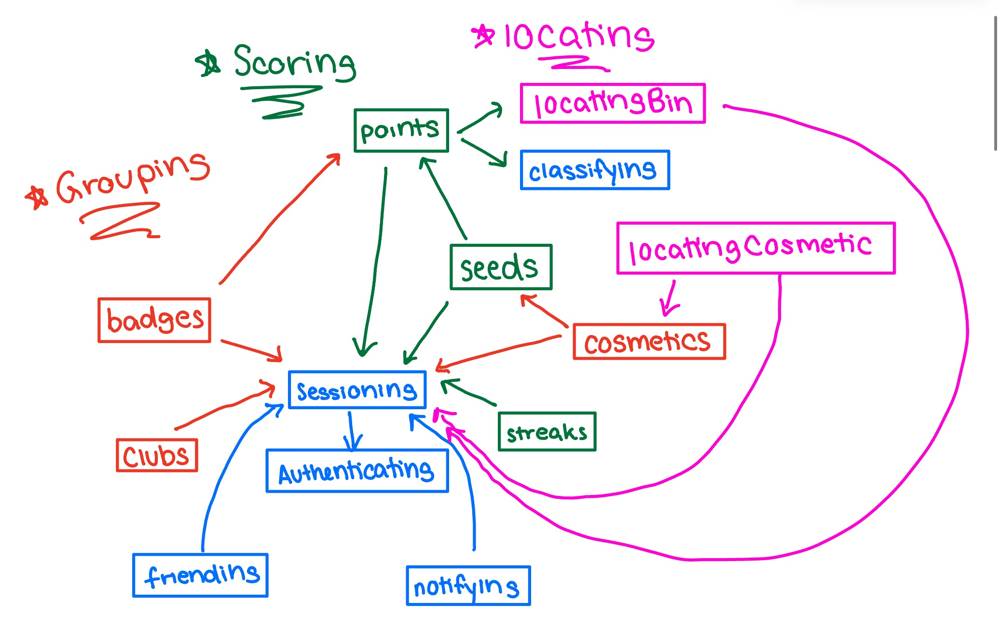

# Project Phase 3 - Convergent Design

## Functional Design

### Concepts

#### Concept 1: Authenticating
*Inspired by an example given in The Essence of Software: Concept composition and sync.*

##### Purpose
Authenticates users so that app users correspond to people.

##### Operational Principle
After a user registers with a username, password and last online timestamp. Users can authenticate themselves with the correct corresponding username and password pair. Each user’s last online time can also be checked and modified.

##### State
`registered`: **set** User

`username`: registered -> **one** String

`password`: registered -> **one** String

`lastOnline`: registered -> **one** Timestamp


##### Actions
register (n: String, p: String, t: Timestamp, **out** u: User)

*Create an user with username n and password p, where t is the current time (since the user just created their account, their last online time is right now).*
```
user.username != n and user.password != p for user in username
username += u
u.username := n
u.password := p
u.lastOnline := t
```
authenticate (n: String, p: String, **out** u: User)

*Attempt authentication for a user, given an input username n and password p.*
```
for user in registered:
    if user.username == n and user.password == p:
        u := user
```
getLastOnline (u: User, **out** t: Timestamp)

*Get a User u’s last online timestamp.*
```
u in registered
t := u.lastOnline
```
updateLastOnline (u: User, t: Timestamp)

*Update a User u’s last online timestamp.*
```
u in registered
u.lastOnline := t
```

#### Concept 2: Sessioning [User]
*Inspired by example given in The Essense of Software: Concept composition and sync.*

##### Purpose
Allows users to stay authenticated for an extended period of time.

##### Operational Principle
After a session starts and before it ends, the getUser action returns the currently authenticated user that was identified at the start of the session.

##### State
`active`: **set** Session

`user`: active -> **one** User

##### Actions
start (u: User, **out** s: Session)

*Start a session with User u.*
```
s not in active
active += s
s.user := u
```
getUser (s: Session, **out** u: User)

*Get the current active session user.*
```
s in active
u := s.user
```
end (s: Session)

*End current session.*
```
active -= s
```

#### Concept 3: Classifying[Item]

##### Purpose
Identifying what category from a set of categories an item belongs to or is associated with.

*While the concept purpose is kept generic, our app will use this concept to store waste classifications of various items.*

##### Operational Principle
A classification can be created, stored, modified, and deleted for an item. A user who provides an item can view what classification that item is associated with. For example, if a user inputs an apple core or a piece of paper, the user will receive a classification of where that item can be disposed of (food waste, paper recycling). If the item is not recyclable, such as a used drink container, the user will receive a classification that the item needs to be trashed.

##### State
`classifications`: **set** Classification

`item`: classifications -> **one** Item

`type`: classifications -> **one** String

##### Actions
classify (i: Item, t: String, **out** c: Classification)

*Create new classification where Item i is classified as type t.*
```
classification.i != i for classification in classifications
classifications += c
c.item := i
c.type := t 
```
getClassification (i: Item, **out** t: String)

*Returns the classification type of an item*
```
for classification in classifications:
    if classification.item == i:
        t := classification.type
```
updateClassification (i: Item, t: String)

*Updates the classification type of an item*
```
for classification in classifications:
    if classification.item == i:
        classification.type := t
```
deleteClassification (i: Item)

*Deletes the classification type of an item*
```
for classification in classifications:
    if classification.item == i:
        classifications -= classification
```
getType (t: String, **out** cs: **set** Classification)

*Returns all items classified as type t*
```
for classification in classifications:
    if classification.type == t:
        cs += classification
```

#### Concept 4: Locating[Coordinates]

##### Purpose
Determining where the nearest desired target is to a user.

##### Operational Principle
- **BinLocating**: User u can add a bin of type b (i.e. recycling, trash, compost) to coordinates c using createLocation(u, c, b). To find the nearest bin of type b to their location uc, a user can use getNearestLocation(uc, b). User u can delete location l using deleteLocation(u, l).
- **CosmeticLocating**: User u can add cosmetic p to coordinates c using createLocation(u, c, p). User u can change the coordinates of cosmetic p to coordinates c2 using changeLocation(u,l,c2). User u can delete location l using deleteLocation(u, l).

##### State
`locations`: **set** Location

`user`: locations ->  **one** User

`coordinates`: locations -> **one** Coordinates

`item`: locations -> **set** Item

##### Actions
createLocation (u: User, c: Coordinates, i Item, **out** l: Location)

*Creates a new location that has a set of items.*
```
l not in locations
locations += l
l.user = u
l.coordinates := c
l.item := i 
```
changeLocation (u: User, l: location, c: coordinates)

*Changes location coordinates to c.*
```
l in locations
l.user == u
l.coordinates := c
```
getNearestLocation (uc: Coordinates, i: String, **out** c: Coordinates)

*Given the user’s current coordinates uc, returns the coordinates c of the nearest location with desired item i.*

*In the pseudo-code below, min() and distance() are used as generic function placeholders for the sake of brevity and can be assumed to handle edge cases properly.*
```
for location in locations:
    if i in location.items:
        c := min(distance(uc, c), distance(uc, location.coordinates))
```
deleteLocation (u: User, l: location)

*Deletes a location.*
```
l in locations
l.user==u
locations-=location
```

#### Concept 5: Scoring[Item]

##### Purpose
Store a numerical score for an item.

##### Operational Principle
- **StreakScoring**: Each new user is initiated at the start with a zero day streak using createScore(u). Each day they perform an action their streak increases by 1 using increaseScore (u, 1). If a day passes without them using their app, their score resets using resetScore(u). 
- **SeedScoring**: Each new user u is initiated at the start with zero seeds using createScore(u). Each time they perform an action on the app, they receive a certain number of points p which increases their seeds by p using increaseScore (u, p). When users purchases a cosmetic with cost c, there seeds decreases by c using decreaseScore(u.c)  
- **PointScoring**: Each new user u is initiated at the start with zero points using createScore(u). Each time they perform an action on the app, they receive a certain number of points p which increases their points by p using increaseScore (u, p). At the end of each week points of all users are reset to zero using resetScore(u).

##### State
`scores`: **set** Score

`item`: scores -> **one** Item

`value`: scores -> **one** Number

##### Actions
createScore (i: Item, **out** s: Score)

*Creates a score for an item with initial value 0.*
```
score.item != i for score in scores
scores += s
s.user := i
s.value := 0
```
getScoreValue (i: Item, **out** v: Number)

*Get the score value of an item.*
```
for score in scores:
    if score.item == i:
        v := score.value
```
increaseScore (i: Item, v: Number)

*Increase the score value of an item by Number v.*
```
for score in scores:
    if score.item == i:
        score.value += v
```
decreaseScore (i: Item, v: Number)

*Decrease the score value of an item by Number v.*
```
for score in scores:
    if score.item == i:
        score.value -= v
```
deleteScore (i: Item)

*Delete the score value of an item.*
```
for score in scores:
    if score.item == i:
        scores -= score
```

resetScore(i:Item)

*Reset the score value of an item to 0.*
```
for score in scores:
    if score.item == i:
        scores.value = 0
```

#### Concept 6: Friending[User]
*Adapted from TA Review Session*

##### Purpose
Creating a relationship between two users.

*Note that the Friending concept does not have any implicit dependency on the User type*

##### Operational Principle
After indicating another user, the current user can request to add the other user to their list of friends. The other user can accept or reject the request. The original user can unsend the request. After accepting the friend request of another user, the either users can remove the other user from their list of friends.

##### State
`friends`: **set** Friend

`user1`: friends -> **one** User

`user2`: friends -> **one** User

`requests`: **set** Request

`from`: requests -> **one** User

`to`: requests -> **one** User

##### Actions
createRequest(f: User, t: User, **out** r: Request)

*Create a friend request from User f to User t.*
```
f != request.from and t != request.to for request in requests
r not in requests
requests += r
r.from := f
r.to := t
```
getIncomingRequests(u: User, **out** rs: **set** Request)

*Get all incoming friend requests to User u.*
```
for request in requests:
    if request.to == u:
        rs += request
```
getOutgoingRequests(u: User, **out** rs: **set** Request)

*Get all outgoing friend requests from User u.*
```
for request in requests:
    if request.from == u:
        rs += request
```
deleteRequest(f: User, t: User)

*Remove a request sent from User f to User t (this can occur when a request is accepted, rejected, or unsent).*
```
for request in requests:
    if request.from == f and request.to == t:
        requests -= request
```
createFriend(u1: User, u2: User, **out** f: Friend)

*Create friendship between User u1 and User u2 (this can occur when a request is accepted).*
```
(friend.user1 == u1 and friend.user2 == u2) or (friend.user2 == u1 and friend.user1 == u2) for friend in friends
friends += f
f.user1 := u1
f.user2 := u2
```

getFriends(u: User, **out** fs: **set** Friend)

*Get all of User u’s friendships.*
```
for friend in friends:
    if friend.user1 == u or friend.user2 == u:
        fs += friend
```
deleteFriend(u1: User, u2: User)

*Remove a friendship between User u1 and User u2.*
```
for friend in friends:
    if (friend.user1 == u1 and friend.user2 == u2) or (friend.user2 == u1 and friend.user1 == u2):
        fs -= friend
```
assertFriends(u1: User, u2: User, **out** friends: Boolean)

*Check if User u1 and User u2 are friends.*
```
friends := False
for friend in friends:
    if (friend.user1 == u1 and friend.user2 == u2) or (friend.user2 == u1 and friend.user1 == u2):
        friends := True
```

#### Concept 7 : Grouping[User, Item]

##### Purpose
Items can be grouped to signify some common trait or relationship.

##### Operational Principle
- **BadgeGrouping**: For each new user u, a group to store badges is created using createGroup(u, ‘Badges’, out g). When they perform a certain action, they receive badge b which is added to their badge group g using addItem(u, b). User u can view their badges using getItems(u)
- **CosmeticGrouping**: For each new user u, a group to store badges is created using createGroup(u, ‘Cosmetics’, out g). When they purchase cosmetic c, c is added to their cosmetic group g using addItem(u, c). User u can view their cosmetics using getItems(u).
- **ClubGrouping**: User u can create a club with name n using createGroup(u, n , out g). User u can add other user u2 to the club g using addItem(u,u2). User u can remove user u2 from club g using removeItem(u,u2). User u can also make u3 an admin of the club g using addAdmin(u,u3), allowing them to add/remove members and admins. To remove user u3’s admin privileges, user u can use removeAdmin(u,u3).

##### State
`groups`: **set** Group

`name`: groups -> **one** String

`items`: groups -> **set** Item

`admins`: group -> **set** User

##### Actions
createGroup(u: User, n: String, **out** g: Group)

*Creates an empty group with name n and admin u.*
```
group.admin != u for group in admins
groups += g
g.name := n
g.admins += u
```
addItem(u: User, i: Item)

*Add item i to the group where User u is an admin.*
```
for group in groups:
    if u in group.admins:
        group.items += i
```
removeItem(u: User, i:Item)

*Remove item i from the group where User u is an admin.*
```
for group in groups:
    if u in group.admins:
        i in group.items
        group.items-=i
```
addAdmin(a: User, u: User)

*Add User u as an admin to the group where User a is an admin if User u is not already an admin for any group.*
```
for group in groups:
     if a in group.admins:
        group.admins += u
```
removeAdmin(a: User, u:User)

*Remove User u as a admin from the group where User a is an admin.*
```
for group in groups:
     if a in group.admin:
	u in group.admins
	group.admins -= u
```
deleteGroup(a: User)

*Delete group where user a in an admin.*
```
for group in groups:
      if a in group.admins:
	groups -= group
```
getItems(a: User, **out** is: **set** Item)

*Get items of group where user a in an admin.*
```
for group in groups:
    if a in group.admins:
        is := g.items
```
getGroupItems(a: User, g: Group, **out** is: **set** Item)

*Get items of a specific group where user a in an admin.*
```
if a in group.admins:
     is := g.items
```

#### Concept 8: Notifying[User, Item]

##### Purpose
Users can be reminded of certain messages.

##### Operational Principle
Notifications can be created containing a String message, Timestamp, a “from” sender and a “to” receiver. The receiver must be a User, but the sender is an Item (either a User or a system notification). These notifications can be deleted after they are created.

##### State
`notifications`: **set** 

`message`: notifications -> **one** String

`time`: notifications -> **one** Timestamp

`from`: notifications -> **one** Item

`to`: notifications -> **one** User

##### Actions
createNotification(m: String, t: Timestamp, f: Item, t: User, **out** n: Notification)

*Send a notification with m message and t Timestamp, sent from Item f to User t.*
```
n not in notifications:
notifications += n
n.message := m
n.time := t
n.from := from
n.to := to
```
getIncomingNotifications(u: User, **out** ns: **set** Notification)

*Get all notifications that are sent to User u.*
```
for notification in notifications:
    if notification.to == u:
        ns += notification
```
getOutgoingNotifications(i: Item, **out** ns: **set** Notification)

*Get all notifications that Item i sent, where Item i could be a User or a system notification.*
```
for notification in notifications:
    if notification.from == u:
        ns += notification
```
deleteNotification(n: Notification)

*Delete an existing Notification n.*
```
n in notifications
notifications -= n
```

### Synchronizations

*Basic sessioning and friending syncs are standard and thus omitted.*

**App** ReCycle 

**Include** Authenticating, Sessioning[Account], Classifying[Item], Locating[Coordinates] as BinLocating, Locating[Coordinates] as CosmeticLocating, Scoring[Account] as StreakScoring, Scoring[Account] as SeedScoring, Scoring[Account] as PointScoring, Friending[Account], Grouping[Account, String] as BadgeGrouping, Grouping[Account, Item] as CosmeticGrouping, Grouping[Account, Account] as ClubGrouping, Notifying[Account, Account]

**Sync** register(username, password: String, time: Timestamp, out account: Account)
```
Authenticating.register(username, password, time, out account)
BadgeGrouping.createGroup(account, ‘Badges’, out group)
CosmeticGrouping.createGroup(account, Cosmetics, out group)
StreakScoring.createScore(account)
SeedScoring.createScore(account)
PointScoring.createScore(account)
```

**Sync** login(username, password: String, time: Timestamp, out account: Account, out session: Session)
```
Authenticating.authenticate(username, password, out account) 
Authenticating.getLastOnline(account, out: last)
if last - time > one day:
    StreakScoring.resetScore(user)
else:
    StreakScoring.increaseScore(user, 1)

Authenticating.updateLastOnline(account, time)
Sessioning.start(account, session)
```

**Sync** scan(user: Account, item: Item, out: Classification)
```
Classifying.getClassification(item, out type)
PointScoring.increaseScore(user, 4)
SeedScoring.increaseScore(user, 4)
BadgeGrouping.addItem(user, “Scanning Badge”)
```

**Sync** locateBin(user: Account, coords: Coordinates, type: Item, out: coordinates: Coordinates)
```
BinLocating.getNearestLocation(user, coords, type, out coordinates)
PointScoring.increaseScore(user, 2)
SeedScoring.increaseScore(user, 2)
BadgeGrouping.addItem(user, “Locating Badge”)
```

**Sync** addBin(user: Account, coords: Coordinates, items: set Item)
```
BinLocating.createLocation(user, coords, items)
PointScoring.increaseScore(user, 10)
SeedScoring.increaseScore(user, 10)
BadgeGrouping.addItem(user, “Bin Adding Badge”)
```

**Sync** removeBin(user: Account, location: Location)
```
BinLocating.deleteLocation(user, location)
```

**Sync** updateBin(user: Account, old: Location, new: Coordinates)
```
BinLocating.changeLocation(user, location, new, items)
PointScoring.increaseScore(user, 5)
SeedScoring.increaseScore(user, 5)
BadgeGrouping.addItem(user, “Bin Updating Badge”)
```

**Sync** getStreak(user: Account, out streak: Score)
```
StreakScoring.getScoreValue(user)
```

**Sync** getSeeds(user: Account, out seeds: Score)
```
SeedScoring.getScoreValue(user)
```

**Sync** purchase(user: Account, cost: number, cosmetic: Item, coordinates: Coordinates, out seeds: Score, out item: Item)
```
SeedScoring.decreaseScore(user, cost)
CosmeticGrouping.addItem(user, item)
BadgeGrouping.addItem(user, “Purchased Cosmetic Badge”)
CosmeticLocating.createLocation(user, coordinates, cosmetic)
```

**Sync** moveCosmetic(user: Account, old: Location, new: Coordinates)
```
CosmeticLocating.changeLocation(user, old, new)
```

**Sync** getPoints(user: Account, out points: Score)
```
PointScoring.getScoreValue(user)
```

**Sync** resetPoints(user: Account)
```
PointScoring.resetScore(user)
```

**Sync** viewBadges(user: Account, out badges: Group)
```
BadgeGrouping.getItems(user)
```

**Sync** viewCosmetics(user: Account, out cosmetics: Group)
```
CosmeticGrouping.getItems(user)
```

**Sync** createClub(user: Account, name: String, out club: Group)
```
ClubGrouping.createGroup(user, name, out club)
PointScoring.increaseScore(user, 3)
SeedScoring.increaseScore(user, 3)
BadgeGrouping.addItem(user, “Club Creation Badge”)
BadgeGrouping.addItem(user, “Club Admin Badge”)
```

**Sync** addClubMember(user: Account, new: Account)
```
if assertFriends(user, new):
     ClubGrouping.addItem(user, new)
     PointScoring.increaseScore(user, 2)
     SeedScoring.increaseScore(user, 2)
     PointScoring.increaseScore(new, 2)
     SeedScoring.increaseScore(new, 2)
```

**Sync** removeClubMember(user: Account, remove: Account)
```
ClubGrouping.removeItem(user, remove)
```

**Sync** addClubAdmin(user: Account, new: Account)
```
if assertFriends(user, new):
    ClubGrouping.addAdmin(user, new)
    PointScoring.increaseScore(user, 2)
    SeedScoring.increaseScore(user, 2)
    PointScoring.increaseScore(new, 2)
    SeedScoring.increaseScore(new, 2)
    BadgeGrouping.addItem(new, “Club Admin Badge”)
```

**Sync** removeClubAdmin(user: Account, remove: Account)
```
ClubGrouping.removeAdmin(user, remove)
BadgeGrouping.removeItem(remove, “Club Admin Badge”)
```

**Sync** viewClubMembers(user: Account, club: Group, out members)
```
ClubGrouping.getGroupItems(user, club, out members)
```

**Sync** remindUser(user: Account, time: Time, out notification)
```
Authenticating.getLastOnline(user, out: last)
if last - time > three days:
    Notifying.createNotification(“It’s been three days since you last recycled!”, time, user, user, out notification)
```

**Sync** sendReminder(user: Account, friend: Account, time: Timestamp, out notification)
```
Notifying.createNotification(“Have you recycled recently?”, time, user, friend, out notification)
PointScoring.increaseScore(user, 2)
SeedScoring.increaseScore(user, 2)
BadgeGrouping.addItem(user, “Friend Reminder Badge”)
```

**Sync** deleteNotification(notif: Notification)
```
Notifying.deleteNotification(notif)
```

**Sync** getOutgoingNotifications(user: Account)
```
Notifying.getOutgoingNotifications(user, out notifications)
```

**Sync** getIncomingNotifications(user: Account, out notifications)
```
Notifying.getIncomingNotifications(user, out notifications)
```

### Dependency Diagram



## Wireframes

Dev Mode Link: https://www.figma.com/design/nj2OxvLugO780QH7EaEWfo/ReCycle?node-id=0-1&t=9fWDyeS9XvJkvF3l-1

Prototype Link: https://www.figma.com/proto/nj2OxvLugO780QH7EaEWfo/ReCycle?node-id=0-1&t=RcHoZ0UMAsbGL9aA-1

## Heuristic Evaluation

### Usability Criteria

#### 1. Pleasantness

- Our wireframes prioritize a minimalistic and in theme design to enhance user focus and simplicity. The primarily white color scheme reduces distractions and aligns with ReCycle’s goal of guiding users to dispose of waste efficiently without encouraging prolonged app usage, promoting digital well-being. Added green helps to make the app more lifelike and colorful, while relating to the theme of helping recycling. This simple theme is fairly pleasant, aligning with the clean visuals that we would like to provide for responsible individuals who are refining recycling habits. The layout employs a straightforward structure, with each tab containing either centrally aligned rectangular elements or linear listings, ensuring intuitive navigation and easy comprehension of visuals.

- However, there is a potential risk that some users might find the interface overly simplistic, which could discourage them from engaging with the app. To address this, incorporating subtle yet engaging visual elements—such as fire icons on the leaderboard or introducing a moderate variety of colors—could enhance the app’s appeal and provide a more polished, popular aesthetic during the frontend development phase.

- Additionally, while the buttons and icons adhere to usability principles by speaking the user's language and offering clear functionality, they currently feel somewhat crude and may not entice users to interact with them. This is particularly critical for the scan button, which is central to the app’s purpose of helping users recycle. Enhancing its design to be more visually striking and aesthetically pleasing could encourage users to use it more effectively, and as a result recycling more.

#### 2. Discoverability

- The simplicity of the interface contributes to strong discoverability in our wireframes. The tab icons are intuitive and clearly represent their functions, making it straightforward for users to navigate the platform. A bottom navigation bar ensures users can access any tab with a single tap, enhancing ease of use.

- Each tab’s interface leverages familiar design patterns: the Scan feature integrates seamlessly with the phone’s camera, the Friends tab mirrors Instagram’s layout, and the Map and Leaderboard follow widely recognized conventions. These familiar elements help users quickly understand and engage with the app.

- Buttons are clearly labeled to indicate their functionality, prioritizing ease of use over aesthetic appeal. This trade-off ensures that users can easily identify actions, although compromising visual refinement as mentioned in the pleasantness heuristic.

- One exception to the intuitive design is the ReCycle Garden, a unique feature that may not be immediately clear to users. Although its placement alongside the Achievements tab highlights thematic similarities, the unfamiliar functionalities—such as managing seeds and growing a plant—could pose a learning curve. To improve usability, incorporating a help message, tooltips, or a dedicated directions tab would assist users in understanding and utilizing this feature effectively.

### Physical Heuristics

#### 1. Fitt’s Law

- Most app features are designed with Fitt’s law in mind, particularly regarding tap distance and hand motion on mobile devices. The navigation bar is placed at the bottom of the screen, aligning with the natural thumb placement and allowing users to tap effortlessly. Core function buttons, such as Scan and Find Bin, are similarly positioned low on the screen, large, and centered, ensuring they are easy to tap with one hand. This placement allows users to quickly initiate the recycling process by simply pulling out their phone and tapping the screen, even while on the go.

- Features located at the top of the screen, such as typing an address into the map search or accessing the user profile, align with their less frequent or less spontaneous use. These actions typically require the user to hold the phone with one hand and interact with the other (or type with both hands), which is reasonable given their intended usage.

- However, our access point for viewing explanations of why an item belongs in a specific bin and navigating back from these explanations, may need to be re-evaluated. These buttons are currently placed at the top of the screen, which can be inconvenient for frequent use. Relocating them to the lower portion of the screen could make them one-handed operations, increasing its usage. Because ReCycle aims to educate users in recycling practices, it is important to make these buttons accessible. 

#### 2. Situational Context

- Our interface does extremely well at providing users with clear situational context. Nearly every tab includes prominently displayed labels that inform users of their current location within the app. For example, the friends, leaderboard and garden store all have clear labeling at the top. Additionally, labeled buttons reinforce this understanding by indicating the destination or action associated with each tap, ensuring smooth navigation.

- The Scan and Map pages are the only exceptions, as they don’t have explicit text labels. However, the camera interface displayed at the center of the screen serves as a strong visual cue for Scan. The dynamic map centered on the Map page is similarly obvious, making these pages very recognizable.

- Overall, the wireframes ensure that users maintain a clear sense of orientation within the app at all times. 

### Linguistic Level

#### 1. Consistency

- The wireframes demonstrate strong consistency across tabs. User listings such as the Friends, Users, and Leaderboard pages share a cohesive vertical structure, using uniform colors, sizes, and fonts. This design mirrors apps like Instagram, making the layout intuitive for users. Similarly, pages like Scan, Map, and Info adhere to a centralized rectangular content format, with main interaction buttons that maintain a consistent design across these tabs. Aside from being consistent within the app, they also draw similarities to apps such as the phone Camera, Google maps, etc.

- The navigation bar icons all have a consistent style. Many icons, such as the Friends and Camera icons, align with those found in widely used apps like Instagram and Snapchat, while the Trophy icon is universally recognizable. However, the Map icon could benefit from increased familiarity—for instance replacing it with the Google Maps' pin icons to be more consistent.

- Most features in ReCycle draw from established app conventions, such as cameras, maps, and user listings. The Garden feature, however, is more novel and so less consistent. It incorporates a game-like aesthetic that may appeal to younger users, but more importantly draws from the appearance of actual gardens to resonate with a broader audience. Notably, having the garden visuals take up the full or larger portion of the screen could make it more immersive and consistent with user expectations. 

#### 2. Information scent

- As mentioned above, most buttons in the app are clearly labeled, providing users with straightforward cues about their functionality or destination. Similarly, the navigation bar uses consistent, recognizable icons that effectively guide users to corresponding tabs. These buttons will provide the bulk of information scent in ReCycle.

- Page titles, as discussed under Situational Context, further reinforce the information scent by indicating the available actions within each tab. For example, tabs like Friends and Leaderboard make their purpose immediately clear through their titles and content.

- The Garden feature, being less familiar than other app functionalities, relies heavily on clear labeling to convey its purpose. Terms like Garden and Seeds offer contextual hints, while buttons labeled with actions like Grow a Plant provide additional guidance on the feature's functionality. When combined with suggested tooltips or instructional overlays (mentioned in Discoverability), these elements can create a strong information scent, making the Garden feature intuitive and accessible for users.

## Visual Design Study

https://docs.google.com/presentation/d/1RJXonjQJKm0_XeAJVFDM1TMxZsioZaBowcCnXLoBbDM/edit?usp=sharing

## Project Implementation Plan

### Task Breakdown and Assignments

#### Week 1: Classification and Grouping 

*Note: Sessioning, Authenticating (mostly), and Friending concepts are already implemented from previous assignments.*

- Backend setup for image recognition and classification 
    - Assigned to Tony
    - Deadline: Day 4
- Frontend components for photo upload 
    - Assigned to Rhea
    - Deadline: Day 6
- Frontend components for classification display 
    - Assigned to Amelia
    - Deadline: Day 6
- Integrating backend and frontend for end-to-end functionality 
    - Assigned to Richard
    - Deadline: Day 7
- Team lead for coordination and alpha release review 
    - Assigned to Rhea

#### Week 2: Locating, Notifying, and Scoring

- Backend for locating nearest bins using geolocation APIs
    - Assigned to Rhea
    - Deadline: Day 9
- Frontend for disposal bin locator UI
    - Assigned to Tony
    - Deadline: Day 9
- Frontend for cosmetics locating
    - Assigned to Tony
    - Deadline: Day 9
- Backend for notifying
    - Assigned to Amelia
    - Deadline: Day 9
- Frontend for notifying
    - Assigned to Richard
    - Deadline: Day 9
- Scoring logic and UI integration
    - Assigned to Tony
    - Deadline: Day 14
- Leaderboard creation and ranking logic
    - Assigned to Amelia
    - Deadline: Day 14
- Friend and group relationship management
    - Assigned to Richard
    - Deadline: Day 14
- Team lead for beta release testing and review
    - Assigned to Rhea

#### Week 3

- Final testing, bug fixes, and polish
    - All Members
    - Deadline: Day 21
- User testing coordination and final release preparation
    - Assigned to Rhea

#### Implementation Order and Dependencies

*Note: Some concepts are already implemented*
- *Concept 1: Authentication*
- *Concept 2: Sessioning*
- *Concept 6: Friending*

##### Week 1 (Alpha Release)
- Focus on build an end-to-end implementation of two concepts
    - *Concept 3: Classifying*
    - *Concept 7: Grouping*.
- Dependencies
    - *Concept 3: Classifying* must be completed before *Concept 7: Grouping* because points/seeds depend on classifying
- Deliverables
    - Backend API for image recognition and classification
    - Three group instances
    - Minimal frontend for capturing user input and displaying results

##### **Week 2 (Beta Release)**
- Focus on implementing remaining concepts
    - *Concept 4: Locating*
    - *Concept 5: Scoring*
    - *Concept 8: Notifying*
- Dependencies
    - *Concept 4: Locating* depends on the disposal categories from *Concept 3: Classifying*.
    - *Concept 5: Scoring* depends partially on *Concept 3: Classifying*.
    - *Concept 8: Notifying* is standalone but adds engagement functionality and is less critical than previous features.
- Deliverables
    - Users can identify and classify items, locate disposal bins, and receive reminders to recycle.
    - Users can engage with other users, make friends, and create group leaderboards.
    - App will include basic styling.

##### Week 3 (Final Release)
- Focus
    - Complete user testing
    - Polish UI
- Deliverables
    - Polished UI
    - Results from user testing
    - Bug fixes
    - Final enhancements

### General Contingency Plan

If issues arise (e.g. technical challenges, time constraints), we will:

1. Prioritize core functionality
    - Complete Concepts 1–4 to ensure the app fulfills its primary purpose
        - Identifying
        - Classifying
        - Locating items
2. Drop or scale back non-core features:
    - Simplify or omit Concepts 4–8
        - e.g. only implement scoring without leaderboarding or friending features
3. Focus on usability:
    - Spend remaining time ensuring smooth user interactions and addressing critical bugs
4. Shift resources:
    - Reassign tasks to balance workloads and resolve bottlenecks

This adaptive approach ensures that the app delivers its core value even under unforeseen challenges.

### Contingency Plan for AI Object Detection Failure

If AI object detection does not work as expected for item disposal classification, we will adapt by pivoting to simpler, reliable alternatives to ensure the app remains functional and fulfills its core purpose. Here’s the backup plan for item disposal classification

1. Use Manual Input with Preset Options
    - Instead of relying on AI, users will manually select the item type from a dropdown menu or search bar.
    - The app will provide a list of common waste categories (e.g. paper, plastic, compostable, trash) to guide users.
2. Flowchart Classification
    - Give sets of choices to guide the user to what bin an item belongs in
    - Start by identifying the material (paper/plastic/glass/etc), ask guiding questions (e.g. has it been used) to determine which bin
    - Highlighting popular misclassification (e.g. used food containers go into trash or which plastics go into which bins)

### Development Impact and Adjustments

#### Week 1 Adjustments
- Replace AI model integration with a dropdown or search bar for manual item input
- Update frontend tasks to accommodate UI for manual selection
- Backend will prioritize mapping user inputs to disposal categories instead of processing AI predictions

#### Week 2 Adjustments
- Implement flowchart as stretch goals
- Allocate more time for user experience improvements to make manual input intuitive and quick

