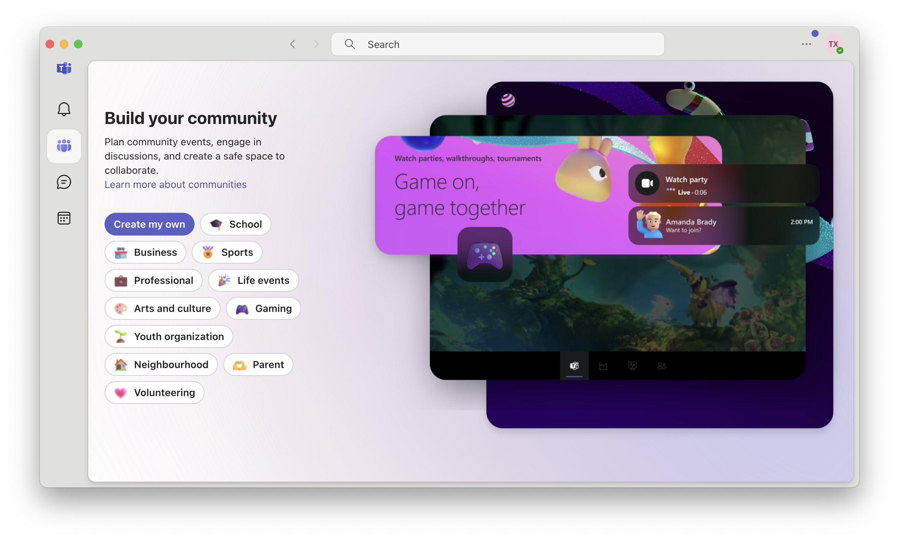
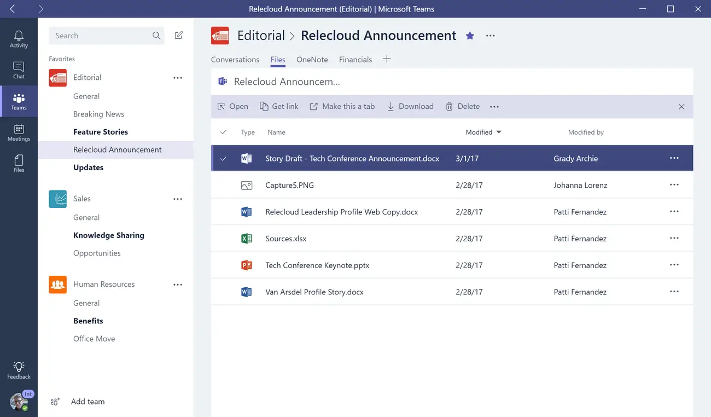

# Evaluating the UI Design of Micrsoft Teams

Microsoft Teams is a widely used communication tool in professional environments. Among the platforms I frequently use in work settings (Teams and Slack), Teams stands out for its more formal, structured design. In this blog, I’ll evaluate Microsoft Teams' UI design through a couple of the design criterias and principles we talked about in lecture 11. 

### Learnability:

Microsoft Teams offers a relatively intuitive interface for new users, primarily because of its clean, straightforward layout. It aligns with familiar patterns seen in other communication tools, making it easier for users to navigate. The platform provides four main tabs: Activity, Calendar, Chat, and Teams, that are well-labeled with simple, recognizable icons. These sections mirror functions that users would have likely encountered in other applications, such as email or messaging platforms. For instance, the Calendar and Chat tabs behave similarly to other scheduling and messaging apps, making them easy to pick up.
The one area that seems less learnable is the "Community" section, which allows for more advanced collaboration features. However, likely acknowledging this, Teams actually provides example graphics to help guide and demonstrate to users the uses and purposes of this feature. In this sense, Microsoft Teams consciously makes an effort to make their application easy to use for those without experience. 

### Efficiency:
Once users are familiar with the basic layout, Teams is an efficient tool for communication and collaboration. Core tasks—like joining meetings, sending messages, or sharing files—can be completed with minimal effort in a few clicks. The UI is uncluttered, with very few distractions, allowing users to focus on their tasks and achieve them quickly.
The integration with other microsoft applications further enhances efficiency by allowing easy access to shared documents, spreadsheets, and presentations within the platform from other related applications. This creates a highly productive workflow, especially for organizations already using Microsoft’s suite of products. Teams is built to keep everything in one place, making it easy for users to switch between tasks without leaving the platform.

### Error Tolerance:
Microsoft Teams excels in error tolerance, providing users with safeguards to prevent costly mistakes. For instance, when a user deletes a message, there’s a brief window where the action can be undone. The platform also prompts users with a confirmation window before performing irreversible actions, such as leaving or deleting a team. This mirrors the familiar experience of deleting local files on your computer, which creates a reassuring sense of control over important decisions. These error tolerance features ensure users can avoid accidental data loss or missteps, which is critical in a professional setting where communication and data integrity are paramount.

### Pleasantness:
While Microsoft Teams is not designed to be flashy, its minimalist approach fits its professional purpose well. The UI’s visual organization is clear and structured, with an emphasis on function over form. This organized minimalist appearance contributes to its overall usability, allowing users to focus on communication without feeling overwhelmed by the interface.
The color palette is subdued, featuring neutral tones like white and blue, which enhances readability and creates a calming, business-appropriate atmosphere. This design likely aligns well with the expectations of a workplace tool. It allows Teams to flourish in its main setting—professional communication—where simplicity and efficiency are more important than flashy design elements.

### Conclusion:
Microsoft Teams stands out as a highly effective tool for professional communication, with a UI design that prioritizes learnability, efficiency, error tolerance, and pleasantness. Its clean, structured interface is easy to pick up for new users while offering advanced features for seasoned professionals. By focusing on simplicity and functionality, Teams excels in supporting business communication, making it a trusted platform in professional environments.

